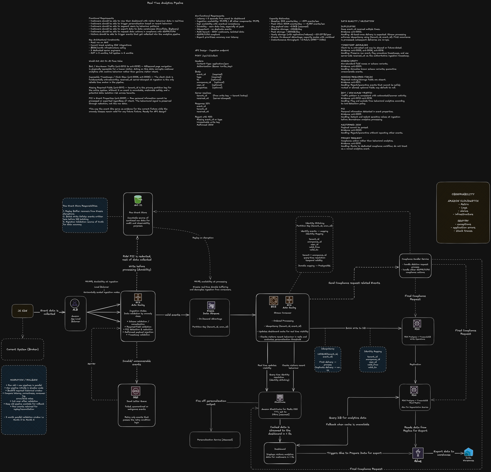

# Real-Time Analytics Architecture

## Architecture Diagram

## Overview

The system processes high-volume event streams through:
- ALB ingress
- EC2 ingestion workers
- Kinesis Data Streams
- ECS stream consumers
- PostgreSQL primary and read replica
- Redis real-time state cache
- S3 raw event replay store
- SQS dead-letter queue
- Glue batch export pipeline